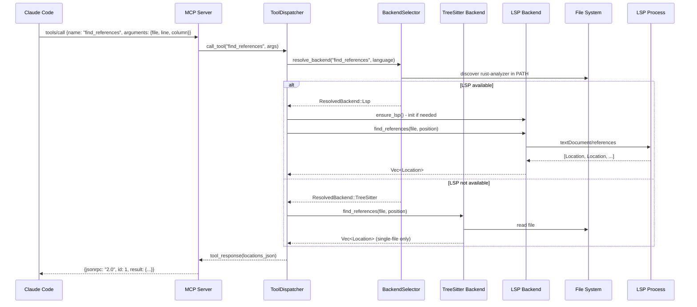

# Rhizome Internals

Code intelligence MCP server for 32 languages. Extracts, parses, and analyzes code symbols using two backend strategies: tree-sitter (fast, no runtime deps) and LSP (full-featured, auto-selected per tool call).

## Workspace Layout

Five crates in dependency order:

```
rhizome-cli
├── depends on: rhizome-mcp
│
rhizome-mcp (MCP server)
├── depends on: rhizome-core, rhizome-treesitter, rhizome-lsp
│
rhizome-core (traits, types, config, backend selection)
├── depends on: (independent)
│
rhizome-treesitter (tree-sitter backend)
├── depends on: rhizome-core
│
rhizome-lsp (LSP backend)
├── depends on: rhizome-core
```

## Core Data Structures

### Language Enum (32 variants)

`rhizome-core/src/language.rs`: Rust, Python, JavaScript, TypeScript, Go, Java, C, C++, Ruby, PHP, Elixir, Zig, C#, F#, Swift, Haskell, Bash, Terraform, Kotlin, Dart, Lua, Clojure, OCaml, Julia, Nix, Gleam, Vue, Svelte, Astro, Prisma, Typst, YAML.

Each language maps to:
- Default LSP server config (binary name, initialization options)
- Tree-sitter language grammar (if available)
- Root detection strategy (e.g., Rust: `Cargo.toml`, Python: `pyproject.toml`)

### CodeIntelligence Trait

`rhizome-core/src/backend.rs`: unified interface for both backends.

```rust
pub trait CodeIntelligence {
    fn get_symbols(&self, file: &Path) -> Result<Vec<Symbol>>;
    fn get_definition(&self, file: &Path, name: &str) -> Result<Option<Symbol>>;
    fn find_references(&self, file: &Path, position: &Position) -> Result<Vec<Location>>;
    fn search_symbols(&self, pattern: &str, project_root: &Path) -> Result<Vec<Symbol>>;
    fn get_imports(&self, file: &Path) -> Result<Vec<Symbol>>;
    fn get_diagnostics(&self, file: &Path) -> Result<Vec<Diagnostic>>;
    fn capabilities(&self) -> BackendCapabilities;
}
```

### BackendCapabilities

Declares what a backend supports:

```rust
pub struct BackendCapabilities {
    pub cross_file_references: bool,    // tree-sitter: false, LSP: true
    pub rename: bool,                    // tree-sitter: false, LSP: true
    pub type_info: bool,                 // tree-sitter: false, LSP: true
    pub diagnostics: bool,               // tree-sitter: false, LSP: true
}
```

Tree-sitter only has capability for single-file symbol extraction. LSP adds cross-file context and type information.

### Symbol

```rust
pub struct Symbol {
    pub name: String,
    pub kind: SymbolKind,    // Function, Struct, Class, Enum, Trait, Type, etc.
    pub location: Location,  // file, line_start, line_end, column_start, column_end
    pub signature: Option<String>,      // e.g., "fn process(data: &[u8]) -> Result<()>"
    pub doc_comment: Option<String>,    // extracted from preceding comments or docstrings
    pub children: Vec<Symbol>,          // nested symbols (impl methods, class members)
}
```

## Backend Selection

`rhizome-core/src/backend_selector.rs`: routes tool calls to the right backend.

```
Tool Requirement         Examples                 Behavior
────────────────────────────────────────────────────────────────
TreeSitter               get_symbols, get_structure  → always tree-sitter
PrefersLsp               find_references, get_diagnostics → LSP if available, else tree-sitter
RequiresLsp              rename_symbol, get_hover_info   → LSP or error
```

### Selection Flow

```
Tool call (e.g., find_references)
    ↓
BackendSelector.select(tool_name, language)
    ↓
Tool requirement lookup (tree-sitter / prefers-lsp / requires-lsp)
    ↓
If PrefersLsp or RequiresLsp:
    → probe_language(language) → detect binary in PATH or auto-install
    ↓
If found: use LSP
If not found: use tree-sitter (or error if RequiresLsp)
```

### LspInstaller

`rhizome-core/src/installer.rs`: auto-install missing LSP servers to `~/.rhizome/bin/`.

20+ install recipes keyed by binary name:

| Binary | Manager | Install Strategy |
|--------|---------|------------------|
| `rust-analyzer` | rustup | ManagerOwned |
| `pyright-langserver` | pipx | PipxOrPip (fallback to pip) |
| `typescript-language-server` | npm | NpmPrefix |
| `gopls` | go | BinEnv (GOBIN) |
| `solargraph` | gem | GemBinDir |

Controlled by `RHIZOME_DISABLE_LSP_DOWNLOAD=1` environment variable.

## Tree-Sitter Backend

`rhizome-treesitter/src/lib.rs`: implements `CodeIntelligence` via tree-sitter parsing.

### ParserPool

`rhizome-treesitter/src/parser.rs`: caches parsers by language.

```rust
pub struct ParserPool {
    parsers: HashMap<Language, tree_sitter::Parser>,
}
```

Lazy-initialized on first use. Each language has its tree-sitter grammar loaded once per parser instance.

### Query Patterns

`rhizome-treesitter/src/queries.rs`: language-specific tree-sitter queries for symbol extraction.

Example (Rust):

```rust
pub const RUST_QUERY: &str = r#"
(function_item name: (identifier) @name) @function
(struct_item name: (type_identifier) @name) @struct_def
(enum_item name: (type_identifier) @name) @enum_def
(trait_item name: (type_identifier) @name) @trait_def
(impl_item type: (type_identifier) @name) @impl_def
(use_declaration) @import
(const_item name: (identifier) @name) @const_def
(static_item name: (identifier) @name) @static_def
"#;
```

Queries use captures (`@name`, `@function`, etc.) to extract structure. Each language has a dedicated query or falls back to generic AST walk.

**10 languages with query patterns:**
- Rust, Python, JavaScript, TypeScript, Go, Java, C, C++, Ruby, PHP

**Generic fallback:**
- Walks AST looking for function_definition, class_declaration, import_statement, etc.
- Available for ~8 additional languages (Bash, C#, Elixir, Lua, Swift, Zig, Haskell, TOML)

### Symbol Extraction

`rhizome-treesitter/src/symbols.rs`: extracts and annotates symbols.

**Flow:**

```
Parse file with tree-sitter
    ↓
Try language-specific query
    ├─ Success: extract via captures
    └─ Fail: use generic AST walk
    ↓
For each symbol node:
    • Extract name (from @name capture or node field)
    • Extract kind (function, struct, class, etc.)
    • Extract location (line/column from tree-sitter node)
    • Extract signature (text before first { or :)
    • Extract doc comment (preceding sibling comments or docstring)
    • Extract children (for impl blocks → methods)
    ↓
Return Vec<Symbol>
```

### Generic Fallback

`rhizome-treesitter/src/symbols.rs`: `extract_symbols_generic()` for unsupported languages.

Walks the AST looking for common node kinds:

```rust
const GENERIC_FUNCTION_KINDS: &[&str] = &[
    "function_definition", "function_declaration", "function_item",
    "method_definition", "method_declaration", "arrow_function", "lambda", "func_literal",
];

const GENERIC_CLASS_KINDS: &[&str] = &[
    "class_definition", "class_declaration", "struct_item", "struct_definition",
    "interface_declaration", "trait_item", "enum_definition", "enum_item",
    "type_definition", "type_alias", "type_alias_declaration",
];
```

For each node, tries to extract the name from common fields (`name`, `declarator`, `pattern`), or falls back to the first named child that looks like an identifier.

**Fallback is best-effort:**
- Some languages (Kotlin, Dart, etc.) have tree-sitter grammars but no dedicated queries
- Kotlin grammar is currently incompatible (uses older tree-sitter version)
- These use generic fallback until queries are added

## LSP Backend

`rhizome-lsp/src/lib.rs`: implements `CodeIntelligence` via Language Server Protocol.

### Architecture

```
LspBackend
├── manager: Arc<Mutex<LanguageServerManager>>
├── handle: tokio::runtime::Handle
└── default_root: PathBuf
```

**Key design:**
- `block_on()` bridges async LSP calls to sync trait methods
- Multi-client manager keyed by `(Language, PathBuf)` for monorepo support
- Lazy initialization (first tool call that needs LSP spawns it)

### LanguageServerManager

`rhizome-lsp/src/manager.rs`: manages multiple LSP clients (one per language/workspace).

```rust
pub struct LanguageServerManager {
    clients: HashMap<(Language, PathBuf), LspClient>,
}
```

**On get_client request:**

```
Check if client exists and is alive
    ├─ Yes: return it
    └─ No: spawn new one

Lookup language server config (custom or default)
    ↓
Auto-install if missing (via LspInstaller)
    ↓
Spawn LSP subprocess (e.g., `rust-analyzer`)
    ↓
Initialize with LSP protocol handshake
    ↓
Cache and return
```

If a process exits, it's respawned on the next call.

### LspClient

`rhizome-lsp/src/client.rs`: JSON-RPC 2.0 client for a single LSP process.

**Async interface:**

```rust
pub async fn document_symbols(&self, file: &Path) -> Result<Option<DocumentSymbolResponse>>;
pub async fn find_references(&self, file: &Path, position: Position) -> Result<Vec<Location>>;
pub async fn workspace_symbols(&self, pattern: &str) -> Result<Option<WorkspaceSymbolResponse>>;
pub async fn initialize(&mut self, workspace_root: &Path) -> Result<()>;
```

Uses `lsp-types` crate for type-safe LSP message handling. Converts LSP responses to Rhizome types in `convert.rs`.

## MCP Server

`rhizome-mcp/src/server.rs`: JSON-RPC 2.0 server reading from stdin, writing to stdout.

### Server Loop

```rust
pub async fn run(&mut self) -> Result<()> {
    self.spawn_auto_export();

    let stdin = io::stdin();
    for line in stdin.lock().lines() {
        let request: Value = serde_json::from_str(&line)?;
        let id = request.get("id").cloned();
        let method = request.get("method").and_then(|m| m.as_str()).unwrap_or("");

        // Skip notifications (no id)
        if method == "notifications/initialized" { continue; }

        let response = self.handle_method(method, &request, id.clone());
        self.write_response(&response)?;
    }
    Ok(())
}
```

### Methods Handled

1. `initialize` → return protocol version and tool list
2. `tools/list` → return available tools (expanded or unified mode)
3. `tools/call` → dispatch to tool handler via `ToolDispatcher`

### Unified vs Expanded Mode

**Expanded mode** (default):
- Each tool is a separate entry in the tools/list response
- Example: `get_symbols`, `get_definition`, `find_references` (24 tools)

**Unified mode** (Cap uses this):
- Single `rhizome` tool with `command` argument
- Example: `rhizome` tool with `command: "get_symbols"`
- Better for tools that want a compact tool list

### Auto-Export to Hyphae

On startup, spawns a background task that:

1. Checks if Hyphae is available
2. Reads `RhizomeConfig` (enable/disable auto-export)
3. Extracts code graph using tree-sitter backend
4. Exports to Hyphae via CLI

## Tool Dispatcher

`rhizome-mcp/src/tools/mod.rs`: routes tool calls to backends.

### Key Pattern

```rust
pub struct ToolDispatcher {
    treesitter: TreeSitterBackend,
    lsp: RefCell<Option<rhizome_lsp::LspBackend>>,  // lazy init
    selector: RefCell<BackendSelector>,
    project_root: PathBuf,
}

pub fn call_tool(&self, name: &str, args: Value) -> Result<Value> {
    match name {
        // Tree-sitter tools (always)
        "get_symbols" => symbol_tools::get_symbols(&self.treesitter, &args),
        "get_structure" => symbol_tools::get_structure(&self.treesitter, &args),

        // Auto-select tools (prefer LSP, fallback to tree-sitter)
        "find_references" => {
            let ts = &self.treesitter;
            self.dispatch_auto(
                name, &args,
                |a| symbol_tools::find_references(ts, a),
                |lsp, a| symbol_tools::find_references(lsp, a),
            )
        }

        // LSP-required tools (error if unavailable)
        "rename_symbol" => self.dispatch_lsp_required(name, &args, |lsp, a| {
            file_tools::rename_symbol(Some(lsp), a)
        }),

        // Edit tools (direct path access)
        "replace_symbol_body" => {
            edit_tools::replace_symbol_body(&self.treesitter, &args, &self.project_root)
        }

        // Export tools
        "export_to_hyphae" => {
            export_tools::export_to_hyphae(&self.treesitter, &args, &self.project_root)
        }
    }
}
```

### Dispatch Helpers

**`dispatch_auto`**: for tools that prefer LSP but can fall back to tree-sitter.

```
resolve_backend(tool_name, language)
    ├─ TreeSitter: call tree-sitter handler
    ├─ Lsp: ensure_lsp() → call LSP handler
    └─ LspUnavailable: call tree-sitter handler (fallback)
```

**`dispatch_lsp_required`**: for tools that need LSP or error.

```
resolve_backend(tool_name, language)
    ├─ Lsp: ensure_lsp() → call LSP handler
    ├─ TreeSitter: return error "requires LSP"
    └─ LspUnavailable: return error with install hint
```

**`ensure_lsp`**: lazy initialization in the MCP server thread.

```rust
fn ensure_lsp(&self) {
    if self.lsp.borrow().is_some() { return; }
    match tokio::runtime::Handle::try_current() {
        Ok(handle) => {
            let backend = rhizome_lsp::LspBackend::new(self.project_root.clone(), handle);
            *self.lsp.borrow_mut() = Some(backend);
        }
        Err(_) => { /* no tokio runtime, skip LSP */ }
    }
}
```

## Edit Tools

`rhizome-mcp/src/tools/edit_tools.rs`: file-level edits with path validation.

### Path Validation

Prevents path traversal attacks:

```rust
fn resolve_path(file: &str, project_root: &Path) -> Result<PathBuf> {
    let resolved = if p.is_absolute() {
        p.to_path_buf()
    } else {
        project_root.join(p)
    };

    let canonical = resolved.canonicalize().unwrap_or(resolved.clone());
    let canonical_root = project_root.canonicalize().unwrap_or(project_root.to_path_buf());

    if !canonical.starts_with(&canonical_root) {
        bail!("Path traversal denied: {} outside {}", canonical.display(), canonical_root.display());
    }
    Ok(resolved)
}
```

### Tool Operations

- `replace_symbol_body`: find symbol via backend, replace lines
- `insert_after_symbol` / `insert_before_symbol`: add content around symbol
- `replace_lines` / `insert_at_line` / `delete_lines`: line-based edits
- `create_file`: create new file with parent directory creation

All operations use read/write line-based file access (100 line file = 100 allocations in worst case, acceptable for typical source files).

## Export to Hyphae

`rhizome-mcp/src/tools/export_tools.rs`: build code graph and push to Hyphae.

### Code Graph Building

`rhizome-core/src/graph.rs`: converts symbol tree to concept nodes + edges.

```
Symbol (e.g., function "process")
    ↓
Concept node {
    name: "process",
    type: "function",
    file: "lib.rs",
    line: 42,
    details: { params: [...], returns: "Result<()>" },
}

Symbol with children (e.g., impl block)
    ├─ child method "new"
    ↓
Concept edges:
    - "Config" → "new" (method relationship)
    - "new" → "Config" (type reference)
```

### Export Flow

```
TreeSitterBackend.get_symbols(file) → Vec<Symbol>
    ↓
Convert each Symbol to Concept + edges
    ↓
Batch insert into Hyphae via CLI
    (e.g., `hyphae store --topic "code/module" ...`)
    ↓
On successful export, create Memoir with concepts + links
```

Incremental: only re-exports changed files (via mtime tracking).

## Configuration

`rhizome-core/src/config.rs`: `RhizomeConfig` from `.rhizome.json` or environment.

```json
{
  "auto_export": true,
  "exclude_patterns": ["**/node_modules", "**/.git"],
  "lsp": {
    "disable_download": false,
    "bin_dir": "~/.rhizome/bin",
    "servers": {
      "rust": "rust-analyzer",
      "python": "pyright-langserver"
    }
  }
}
```

## Testing

### Fixtures

`rhizome-treesitter/tests/fixtures/`: real source files (sample.rs, sample.py, sample.java, sample.cpp, sample.rb, sample.php, sample.c, large_sample.rs).

### Test Strategy

**Unit tests** in each module:
- Symbol extraction (kind, name, location, doc comment, signature)
- Impl method extraction
- Import detection
- Capabilities validation

**Snapshot tests**: use `insta` crate for output format changes.

**Integration tests**: real end-to-end tool calls (run with `--ignored`).

**Performance tests**: verify <5ms parse time for large files.

### Language Coverage

- **Rust**: full tests (symbol kinds, impl methods, doc comments, signatures)
- **Python**: symbol extraction, kind classification, imports
- **Java**: class/interface/enum, methods, imports
- **C/C++**: functions, structs, enums, typedefs, macros
- **Ruby**: classes, modules, methods, singleton methods
- **PHP**: classes, interfaces, traits, methods

## Data Flow Diagram



## Key Invariants

1. **Thread safety**: MCP server is single-threaded; LSP calls use `block_on()` safely
2. **Lazy initialization**: LSP only spawned if a tool actually needs it
3. **Auto-install**: missing LSP servers installed to `~/.rhizome/bin/` (unless disabled)
4. **Fallback chain**: RequiresLsp → error; PrefersLsp → tree-sitter; TreeSitter → always
5. **Path safety**: all file operations validate that paths stay within project root
6. **Stateless tools**: tool calls have no side effects (except auto-export background task)
