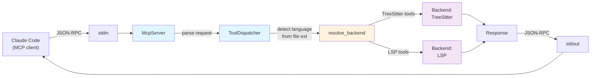
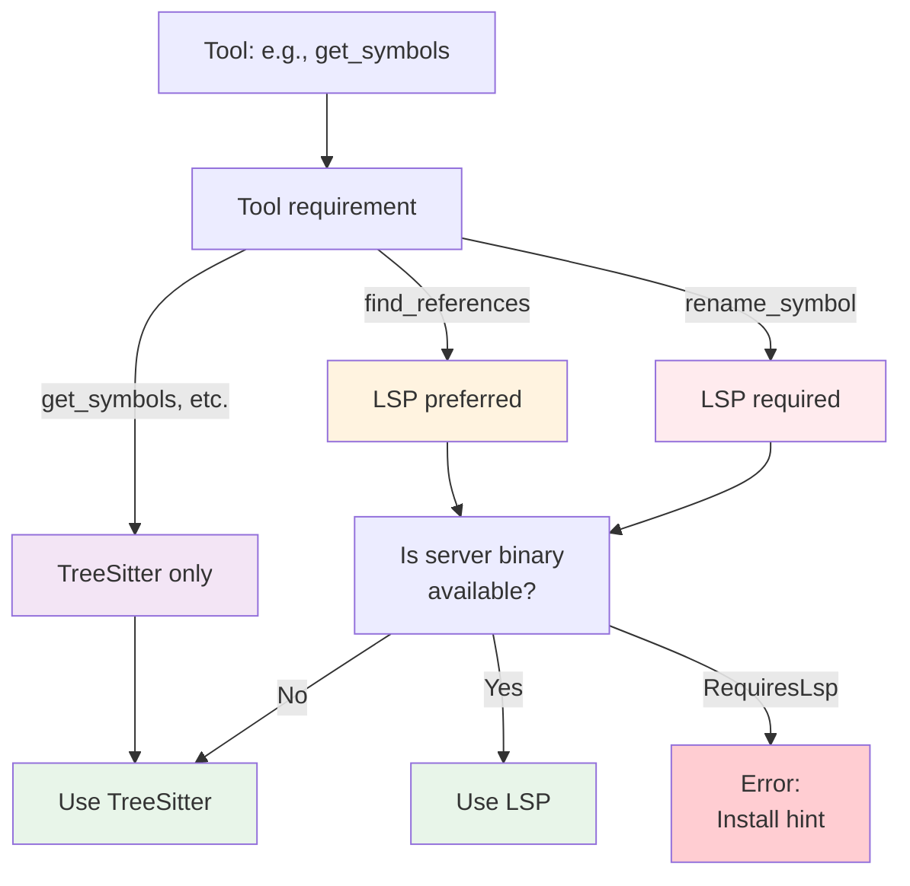

# Rhizome Internals

This document explains how Rhizome works under the hood: crate layout, request flow, backend selection, symbol extraction, LSP management, and file editing.

## Crate Layout

Rhizome is a 5-crate workspace that compiles into a single binary:

```
rhizome-core
├─ Domain types: Language, Symbol, Location, SymbolKind
├─ Traits: CodeIntelligence
├─ BackendSelector: Auto-select tree-sitter vs LSP per tool
├─ LspInstaller: Auto-install missing LSP servers
└─ Utilities: root detection, config, code graphs

rhizome-treesitter
├─ Implements CodeIntelligence via tree-sitter parsing
├─ ParserPool: Reusable parsers per language
├─ Query patterns: Language-specific symbol extraction
└─ Generic fallback: Common AST node types

rhizome-lsp
├─ Implements CodeIntelligence via Language Server Protocol
├─ LanguageServerManager: Multi-client support (per language + root)
└─ Async bridge: block_on() to support sync trait

rhizome-mcp
├─ 26 MCP tools for code intelligence
├─ ToolDispatcher: Routes calls to backends
└─ Export tools: Code graph → Hyphae integration

rhizome-cli
└─ CLI: serve, symbols, structure, status, export, init
```

Dependency direction: `CLI → MCP → (TreeSitter, LSP) → Core`

## Request Flow: MCP Request → Response

When Claude Code calls an MCP tool:



**Detailed flow**:

1. **stdin loop** (`server.rs:32`): Read newline-delimited JSON-RPC 2.0 requests
2. **Parse request** (`server.rs:46`): Extract `method`, `id`, and `params`
3. **Dispatch** (`server.rs:117`): Route to handler (initialize, tools/list, tools/call)
4. **tools/call** (`server.rs:210`): Extract tool `name` and `arguments`
5. **Call dispatcher** (`tools/mod.rs:61`): Route to specific tool handler
6. **Write response** (`server.rs:245`): Send JSON-RPC response to stdout

## Backend Selection

The `BackendSelector` (in `rhizome-core/src/backend_selector.rs`) decides which backend each tool uses:



**Tool requirements** (`backend_selector.rs:139`):

| Tool | Backend |
|------|---------|
| `get_symbols`, `get_structure`, `get_definition`, 18 others | TreeSitter |
| `find_references`, `get_diagnostics` | Prefer LSP, fallback to TreeSitter |
| `rename_symbol`, `get_hover_info` | Require LSP, error if unavailable |

**Auto-install flow**:

1. **detect_language** (`tools/mod.rs:237`): Extract file extension, convert to `Language`
2. **resolve_backend** (`tools/mod.rs:221`): Call `selector.select(tool_name, language)`
3. **probe_language** (`backend_selector.rs:126`): Check cache, then call `probe_server`
4. **probe_server** (`backend_selector.rs:230`): Try `installer.ensure_server(language, binary)` — auto-installs to `~/.rhizome/bin/` if needed
5. **Return decision**: `ActiveBackend::TreeSitter`, `ActiveBackend::Lsp`, or `ActiveBackend::Error(hint)`

## Tree-Sitter: Parser Pool & Symbol Extraction

The `TreeSitterBackend` uses a pool of reusable parsers and language-specific query patterns:

```
ParserPool (per language)
    ├─ Parser 1 (Rust)
    ├─ Parser 2 (Python)
    └─ Parser N

Symbol Extraction
    ├─ Try language-specific query (symbols.rs:14)
    └─ Fallback to generic AST walk (symbols.rs:262)
```

**Query patterns** (10 languages with full extraction):

- Rust, Python, JavaScript, TypeScript, Go, Java, C, C++, Ruby, PHP
- Each has a `.scm` query file in `crates/rhizome-treesitter/src/queries/`
- Queries use tree-sitter capture groups: `@function`, `@struct_def`, `@import`, etc.

**Generic fallback** (8 languages):

- Bash, C#, Elixir, Lua, Swift, Zig, Haskell, TOML
- Walks the AST looking for common node types:
  - `GENERIC_FUNCTION_KINDS`: `function_definition`, `function_item`, `method_declaration`, etc.
  - `GENERIC_CLASS_KINDS`: `class_definition`, `struct_item`, `interface_declaration`, etc.
  - `GENERIC_IMPORT_KINDS`: `import_statement`, `use_declaration`, `require_call`, etc.
- Extracts name from node fields (`name`, `declarator`, `pattern`) or first identifier child

**Symbol extraction steps** (`symbols.rs:7`):

1. Parse file to tree-sitter `Tree`
2. Get language-specific query or fall back to generic walk
3. For each match:
   - Extract name from `@name` capture
   - Map capture kind to `SymbolKind` (Function, Struct, Enum, etc.)
   - Extract location (line/column), signature, and doc comment
   - For `impl` blocks, recursively extract methods as children
4. Return `Vec<Symbol>`

## LSP: Multi-Client Manager & Root Detection

The `LspBackend` (in `rhizome-lsp/src/lib.rs`) manages multiple language servers for monorepo support:

**Multi-client keying**:

```rust
// Key: (Language, workspace_root_path)
// One LanguageServer per unique (Language, root) pair
clients: HashMap<(Language, PathBuf), LanguageServer>
```

Example: A monorepo with separate roots for `/frontend` (TypeScript) and `/backend` (Rust) needs:
- 1 TS server rooted at `/frontend`
- 1 Rust server rooted at `/backend`

**Root detection per language** (`root_detector.rs`):

- Rust: Look for `Cargo.toml`, walk up tree
- Python: Look for `pyproject.toml` or `setup.py`
- Go: Look for `go.mod`
- JavaScript/TypeScript: Look for `package.json`
- etc. (per-language default strategies)

**Auto-install flow** (`backend_selector.rs:251`):

1. Call `installer.ensure_server(language, binary)`
2. Check `~/.rhizome/bin/{binary}` first
3. If not found, look in system PATH
4. If not found and auto-install enabled (default), run install recipe:
   - `rustup component add rust-analyzer` (Rust)
   - `npm install -g typescript-language-server` (TypeScript)
   - etc. (20+ recipes in `installer.rs`)
5. Return `Ok(Some(path))` or `Ok(None)` if install fails

## Edit Tools: Path Validation

All edit tools (`replace_lines`, `insert_at_line`, `delete_lines`, `create_file`) validate paths:

**Path validation** (`edit_tools.rs`):

1. Extract `path` or `file` argument from MCP request
2. Resolve relative paths against `project_root`
3. Check `path.canonicalize()` doesn't escape `project_root` (path traversal protection)
4. Read/write file
5. Return success response with line count or file content

Example safety check:

```rust
// Prevent ../../../etc/passwd attacks
let canonical = path.canonicalize()?;
let root_canonical = self.project_root.canonicalize()?;
if !canonical.starts_with(&root_canonical) {
    return Err("Path outside project root".into());
}
```

## Unified vs Expanded Tool Mode

The MCP server supports two tool schema modes:

**Expanded mode** (default, 26 separate tools):
```json
{
  "tools": [
    { "name": "get_symbols", "description": "...", "inputSchema": {...} },
    { "name": "get_definition", "description": "...", "inputSchema": {...} },
    ...
  ]
}
```

**Unified mode** (single `rhizome` tool with `command` argument):
```json
{
  "tools": [
    {
      "name": "rhizome",
      "description": "Code intelligence tool. Commands: get_symbols, ...",
      "inputSchema": {
        "properties": {
          "command": { "type": "string" },
          "file": { "type": "string" },
          ...
        }
      }
    }
  ]
}
```

Toggle with `--unified` flag in `rhizome serve`.

## Auto-Export to Hyphae

On server startup, a background task (`server.rs:81`) checks if Hyphae is available and auto-export is enabled in `rhizome.toml`:

```toml
[export]
auto_export = true
```

If enabled:
1. Use TreeSitter backend to extract project symbols
2. Build code graph (nodes = symbols, edges = dependencies)
3. Push to Hyphae via JSON-RPC (via `spore` IPC)
4. Log completion status

This enables persistent code knowledge across Claude Code sessions.

## Configuration

`rhizome.toml` in project root:

```toml
[export]
auto_export = true              # Auto-export to Hyphae on startup
export_all_symbols = false      # Only export public symbols (default)
incremental = true              # Only export changed files (default)

[lsp]
disable_download = false        # Allow auto-install (default)
bin_dir = "~/.rhizome/bin"      # Where to install servers

[[languages]]
name = "rust"
tree_sitter_query = "custom.scm"  # Override query pattern
server_binary = "rust-analyzer"   # Override server binary
```

---

**Summary**: Rhizome's architecture optimizes for speed (tree-sitter) with precision (LSP) when needed. The backend selector auto-chooses per tool, the parser pool reduces latency, and auto-install removes setup friction. Multi-client LSP support handles monorepos, and path validation secures file editing.
